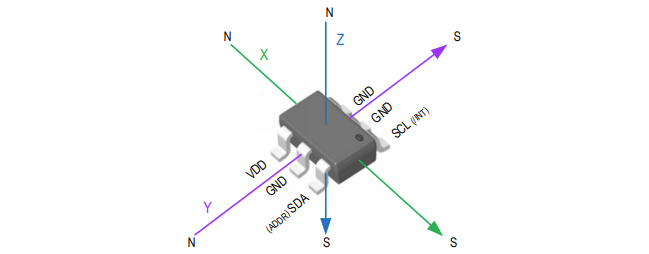
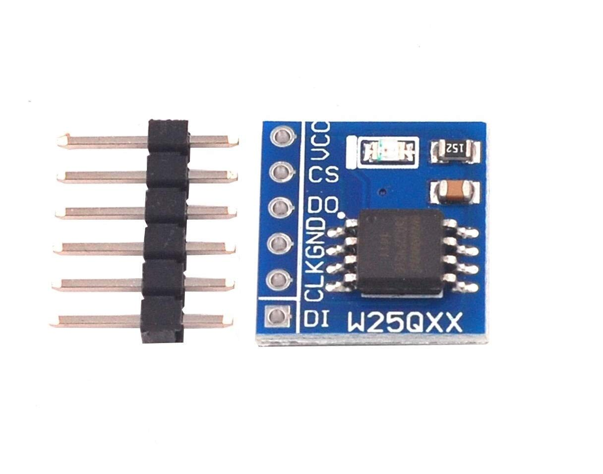
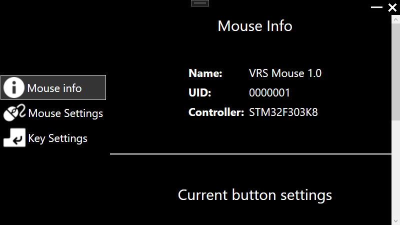
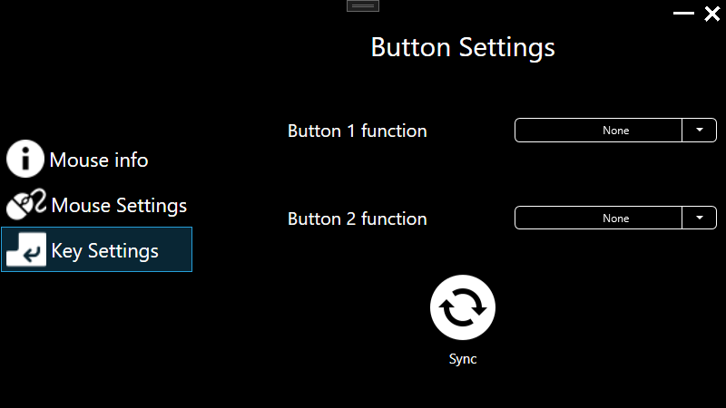
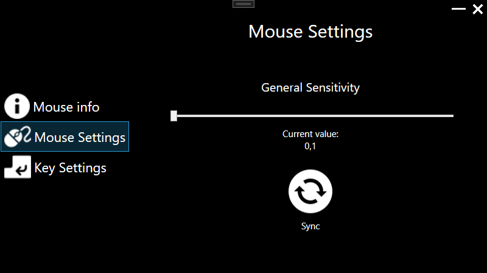

# DIY 3D Mouse for CAD programs

- code on STM32F303K8
- Drivers
  - TLV493D (3-axis magnetometer)
  - W25Q32 (flash)
- 3D Models of mouse
- Windows utilities
  - python server for communication
  - python script for keyboard commands
  - python script for USART communication
  - WPF GUI in C#

# About

This project aims to help CAD designers create their own 3D DIY Mouse for a cheaper price than usual.

With a 3D Mouse, a designer is able to model significantly faster than with a classic 2D mouse.
The brain of our project is a microcontroller STM32F303K8, which communicates with a 3D magnetic
sensor TLV493D and transforms its data, so that they can be used in a CAD programme. This, in turn reduces
the amount of movements necessary for certain operations (e.g. rotation of an object).

The project allows users to configure their own mouse sensitivity in the form of DPI and to choose their own Action Buttons using the Windows App. Data for mouse sensitivity and key bindings are stored on an external flash memory chip W25Q32. 

# Drivers

We created drivers in the StmCubeIDE for all external HW.

## TLV493D

The 3D magnetic sensor TLV493D-A1B6 detects the magnetic flux density in three directions; x, y and z. The
magnetic flux density in the z-direction (Bz) is detected by a lateral-Hall plate parallel to the surface of the
chip. The magnetic flux density in the x- and y-direction (Bx and By) are detected by vertical-Hall plates
perpendicular to the surface of the chip.

    

The MCU communicates with the sensor over I2C.

## W25Q32

External serial flash memory W25Q32 (32M-bit) serves as a storage place for user configuration of DPI and Action Buttons. 
It is organized into 64 blocks, each consisting of 16 sectors, each consisting of 16 programmable pages of 256-bytes each. Together that is 4MB of storage space. 

    

The W25Q32 supports SPI which is used for communication with the STM32F303K8.

## Sending commands to PC
### Python script
For the proper function of the 3D mouse, it is necessery to start a python script, which handles communication with STM32 and the Windows application.
  
#### Main thread
The main thread of the python script listens to JSON messages sent by STM32 through USART, which consist of 3 values representing rotation of axes. On top of that, if a button was pressed, which had previously been configured with the App, the STM32 will also send a numerical value representing the specific bind of the Action Button.
This thread is also able to read or write data to the STM32, which represents the current configuration of mouse sensitivity and Action Buttons.
#### Server thread
The server thread of our python script handles HTTP communication with the Windows Application. It creates a localhost server on port 12345 and offers two types of requests for clients. The first request is a GET request with the path /ma/api/all which returns a JSON message consisting of DPI, Action Button 0 and Action Button 1. The second request is of type POST and requires a JSON body consisting of the same configuration parameters as mentioned in the previous request.

# Models

Folder models contains .stl model files which are the 3D representation of 3D mouse.

# App

The PC app is a WPF GUI, which communicates with the microcontroller via UART trough a IO port.

It provides seamless communication without the user knowing anything about the device.

Since the app uses WPF it is only available on Windows 10 or higher.

    

## Features

 - Provides basic mouse information

 

    

 - Button mapping

 

    

 - Mouse axis sensitivity settings

 

    

